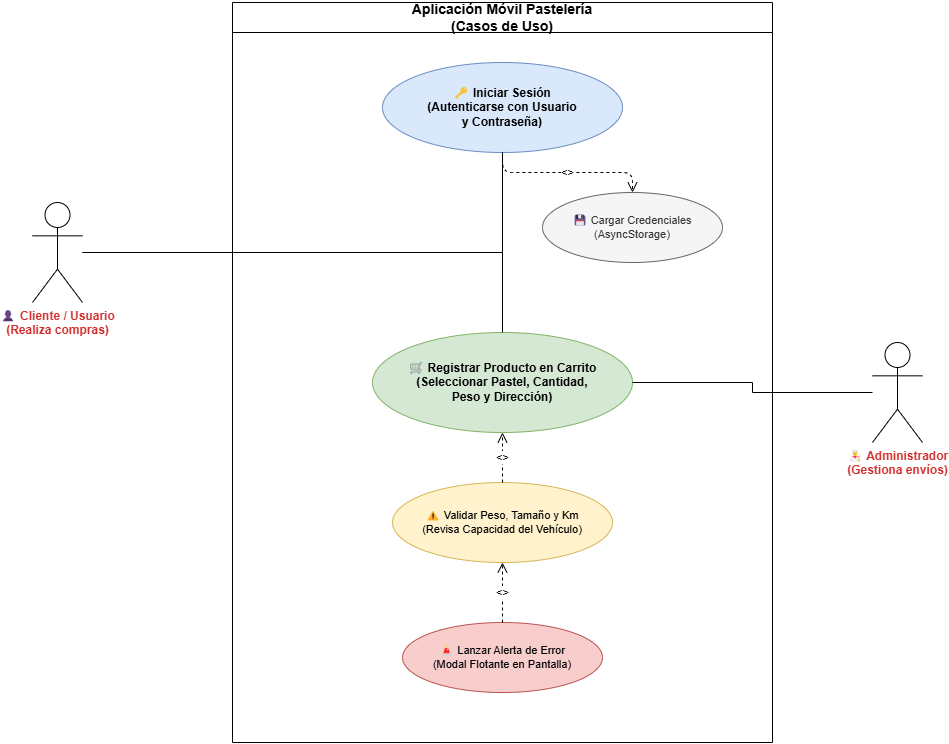
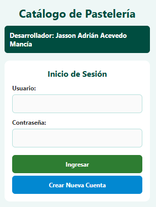
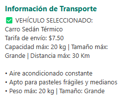

# Guía Visual de Navegación y Uso de la Aplicación

Bienvenido a la guía de uso del **Catálogo de Pastelería**. Este manual te explicará paso a paso cómo utilizar las funciones principales de forma rápida, segura y sencilla.

---

## 1. Mapa General de Navegación

A continuación se muestra el recorrido visual de las pantallas dentro de la aplicación, desde la autenticación inicial hasta la realización de tus pedidos:

---

## 2. Paso a Paso: Cómo Iniciar Sesión

Para acceder a tu cuenta y gestionar tus pedidos en la aplicación, realiza las siguientes acciones:

1. **Nombre de Usuario (1):** Escribe el nombre de usuario que elegiste al registrarte.
2. **Contraseña (2):** Ingresa tu clave de acceso personal.
3. **Botón 'Ingresar' (3):** Presiona el botón verde para entrar directamente al catálogo de pasteles.

> **Sugerencia:** Si es tu primera vez en la aplicación, presiona el botón azul **"Crear Nueva Cuenta"** para registrarte. Tus datos de acceso se guardarán automáticamente en tu dispositivo para que no tengas que escribirlos cada vez que reabras la aplicación.

---

## 3. Paso a Paso: Cómo Registrar Información y Realizar un Pedido

Para agregar pasteles a tu carrito, especificar la dirección de entrega y seleccionar el medio de transporte adecuado según el peso y tamaño, sigue estos pasos:

1. **Seleccionar Producto y Cantidad (1):** Utiliza los botones **"+"** o **"-"** para definir la cantidad de pasteles que deseas y presiona **"+ Agregar"** para incluirlo en tu carrito.
2. **Completar Datos de Envío (2):** Ingresa la dirección completa del comprador y especifica la distancia en kilómetros (Km) hasta el lugar de entrega.
3. **Elegir Transporte (3):** Selecciona el medio de transporte disponible (Bicicleta, Moto, Carro o Furgoneta) asegurándote de no sobrepasar el límite de peso (kg), tamaño del pastel y distancia máxima permitida.
4. **Confirmar Compra (4):** Presiona el botón verde **"💳 FINALIZAR COMPRA"** para procesar la orden. Verás un mensaje en pantalla confirmando el detalle y monto total de tu pedido.

> **Nota de Seguridad:** Si seleccionas un vehículo que no soporta el peso total de tus pasteles o supera el límite de kilómetros, la aplicación mostrará una ventana flotante de error pidiéndote seleccionar un vehículo de mayor capacidad.
>
> ---

## 4. Videotutorial del Proyecto

Para una explicación guiada sobre la instalación, navegación por el catálogo, inicio de sesión persistente y prueba de validación de logística de envíos, consulta el videotutorial oficial:

📽️ **[Ver Videotutorial del Proyecto](videos\videotutorial_proyecto.mp4)**